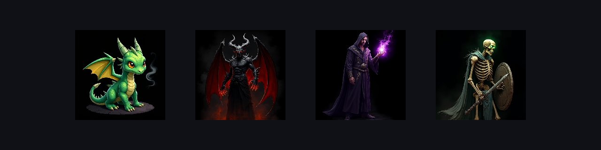
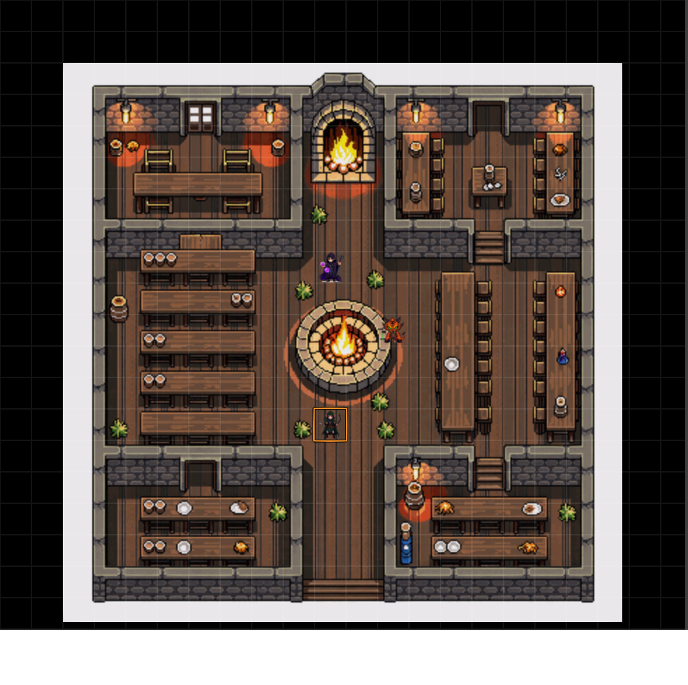
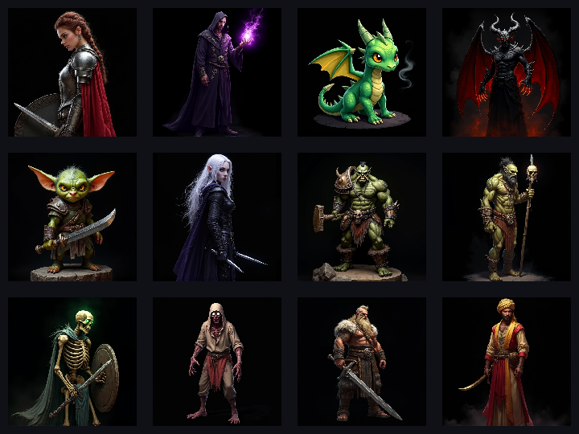
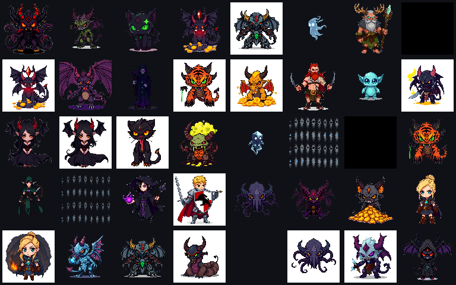
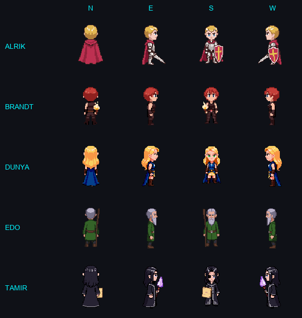
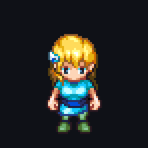
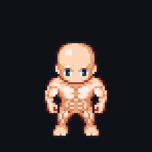

# DSA Pixel-Art Tokens



[](https://foundryvtt.com/)
[]()
[]()
[]()
[](https://ulisses-spiele.de/fan-pakete/)
[]()
[]()
[]()

> ⚠️ **Fan-Projekt / Nicht offiziell** — *Das Schwarze Auge* und *DSA* sind eingetragene Marken der **Ulisses Spiele GmbH**. Dieses Modul steht in keiner Verbindung zum Verlag und ist kein offizielles Produkt. Die enthaltenen Regeldaten (Zauber-Mechaniken, Kreatur-Stats, Waffen-TP, Sonderfertigkeiten) werden unter der **[ELF-Fan-Lizenz](https://ulisses-spiele.de/fan-pakete/)** von Ulisses Spiele genutzt. Der Modul-Code selbst (JavaScript, Sprites, VFX, Logik) steht unter MIT-Lizenz.

> Komplettes Pixel-Art DSA 4.1 Erweiterungsmodul: Animierte Tokens, automatische Zauber- und Kampfeffekte, Pixel-Art Heldenbogen, Proben-Engine, Zonenzauber mit Schaden und 961 Regelbuch-Eintraege.

---

## Eindruecke

**Live auf der Spieltisch-Szene** — Taverne "Zum schwarzen Eber" mit Waldelfen-Wildnislaeufer, Magier und weiteren NSCs am Lagerfeuer:



**16 Charakter-Tokens** (von 700+ im Modul):



**Bestiarium** — 40 zufaellige Kreaturen von 700+:



**Chibi-NSCs** mit 4-Richtungs-Rotation (N / O / S / W):



**Laufanimation** (LPC-Spritesheet-Standard, 9 Frames, 4 Richtungen):

<p align="center">
  
  &nbsp;&nbsp;&nbsp;
  
</p>

---

## Was ist das?

Ein FoundryVTT-Modul das auf dem **gdsa** System (DSA 4.1) aufbaut und es um ein komplettes Pixel-Art Erlebnis erweitert:

- 16-Bit JRPG-Heldenbogen mit Retro-Design
- Automatische VFX bei Kampf und Magie
- Proben-System mit Patzer/Gluecklich-Erkennung
- 298 Zauber + 167 Waffen + 86 Talente direkt aus den Regelbuchern
- Helden-Software XML Import
- Zonenzauber mit Grid-Markierung und automatischem Schaden

---

## Features

### Pixel-Art Heldenbogen

6-Tab Character Sheet mit Retro-Theme (VT323 + Press Start 2P Fonts):

| Tab | Inhalt |
|-----|--------|
| **Werte** | 8 Eigenschaften (klickbar fuer Probe), Vorteile, Nachteile, SF |
| **Talente** | Alle Talent-Kategorien mit Probe und TaW (klickbar fuer 3W20) |
| **Kampf** | Kampftalente mit AT/PA, Waffen, Ruestung, RS/BE |
| **Magie** | Zauberliste mit Probe/ZfW/AsP, klickbar fuer Zauberprobe |
| **Inventar** | Ausruestung, Geld (Dukaten/Silber/Heller/Kreuzer) |
| **Notizen** | Freitext mit Rich-Text Editor |

- Animierte LeP/AsP/AuP-Balken (klickbar zum Bearbeiten)
- Abgeleitete Werte: INI, MR, GS, WS, AT, PA, FK, AW
- Pixel-Art Borders, Retro-Buttons, Gold-Akzente

### Proben-System

- **Eigenschaftsprobe** (1W20): Modifikator-Dialog, Erfolg/Misserfolg/Kritisch/Patzer
- **Talentprobe** (3W20): TaP*-Berechnung, Patzer (Doppel-20), Gluecklich (Doppel-1)
- **Angriff/Parade** (1W20): Kritischer Treffer, Patzer mit Bestaetigungswurf
- **Zauberprobe** (3W20): ZfP*-Berechnung, Spontanmodifikationen, Auto-AsP-Abzug
- Alle Proben mit Pixel-Art Chat-Output und automatischen VFX

### Kampf-System

- **Manoever-Dialog**: 6 Kampfmanoever (Normal, Wuchtschlag, Finte, Gezielter Stich, Meisterparade, Ausweichen) mit AT/PA-Modifikatoren
- **Schaden-Dialog**: TP + KK-Bonus - RS = SP mit Live-Berechnung
- **Wundschwellen**: Automatische Pruefung (KO/2, KO, KO*1.5)
- **Fernkampf**: Reichweiten-Modifikatoren (Nah/Mittel/Fern/Sehr fern)
- **Auto-VFX**: Treffer-Flash, Verfehlung, Fernkampf-Projektile

### Magie-System

- **Spontanmodifikations-Dialog**: 5 Modifikationstypen (Reichweite, Zauberdauer, Wirkungsdauer, Kosten, Erzwingen) mit Live-AsP-Berechnung
- **Auto-Effekte**: Nach erfolgreicher Probe automatisch VFX (Projektil/Aura/Target/Zone)
- **Zonenzauber**: Template platzieren, Zone-Effekt waehlen, Schaden anwenden
- **Zone-Damage**: LeP-Abzug fuer alle Token in der Zone, AsP-Abzug beim Caster
- **Floating Damage Numbers**: Rote/blaue Zahlen schweben ueber betroffenen Token

### 34 Zaubereffekte (Pixel-Art Animationen)

| Typ | Effekte |
|-----|---------|
| **Projektile** | Flammenpfeil, Donnerkeil, Aquafaxius, Odem Arcanum |
| **Ziel-Effekte** | Feuerball, Eis, Blitz, Heilung, Gift, Fulminictus, Horriphobus, Respondami, Motoricus, Balsamsal |
| **Auren** | Armatrutz, Visibili, Attributo, Schattenform, Verwandlung, Brennen, Paralysis, Silentium |
| **Zonen** | Pandemonium, Fesselranken, Invocatio, Daemonenbann, Portal, Planastral, Wind |
| **Reaktionen** | Schadenflash (auto bei LeP-Verlust), Tod-Animation (auto bei LeP 0) |

### 6 Zonen-Effekte (Persistent, Grid-basiert)

| Zone | Typ | Persistent |
|------|-----|-----------|
| Feuerzone | Fill | Ja |
| Eiszone | Fill | Ja |
| Giftzone | Fill | Ja |
| Heilzone | Fill | Ja |
| Sturmzone | Scatter | Nein |
| Dunkelzone | Fill | Ja |

### Animierte Token-Sprites

- **LPC-Spritesheets** (576x256px, 4 Richtungen x 9 Frames)
- **100+ Token**: Magier, Krieger, Druidin, Hexe, Geweihte, Schurke, Soeldner, Elementare, Daemonen, Zombies, Skelette
- **Kreaturen**: Baer, Fuchs, Ratte, Loewe, Pilzmensch, Hai, Hirsch u.v.m.
- **4-Richtungs-Laufanimation**: Automatisch bei Token-Bewegung
- **Pixel-Art Status-Icons**: Vergiftet, Betaeubt, Gesegnet, Gelaehmt, Verwirrt, Blind, Tot, Brennend

### Dice Hooks (gdsa Integration)

- Faengt gdsa Chat-Nachrichten ab und triggert automatisch VFX
- Sound-Effekte bei Treffer/Verfehlung/Patzer/Gluecklich
- Fernkampf-Erkennung: Projektil-Animation wenn Distanz > 2 Felder
- gdsa Parade/Schaden-Buttons mit Pixel-Art Styling

### Helden-Software XML Import

- Datei-Upload Dialog mit Live-Preview
- Parst: Eigenschaften, Talente, Kampftalente, Zauber, V/N/SF, Ausruestung
- Erstellt gdsa-kompatiblen Actor mit allen Items
- Unterstuetzt verschiedene Helden-Software Versionen

---

## Datenbank (961 Eintraege aus Regelbuchern)

Alle Daten direkt aus den offiziellen DSA 4.1 Regelbuchern extrahiert:

| Datei | Eintraege | Quelle |
|-------|-----------|--------|
| `data/spells.json` | 298 Zauber | Liber Cantiones Remastered |
| `data/talents.json` | 86 Talente | Wege der Helden |
| `data/weapons.json` | 144 Nahkampf + 23 Fernkampf | Wege des Schwertes |
| `data/weapons.json` | 17 Schilde + 45 Manoever | Wege des Schwertes |
| `data/armor.json` | 42 Ruestungen + Helme | Wege des Schwertes |
| `data/advantages.json` | 85 Vorteile | Wege der Helden |
| `data/disadvantages.json` | 126 Nachteile | Wege der Helden |
| `data/special-abilities.json` | 112 Sonderfertigkeiten | Wege der Helden + Schwertes |

---

## Installation

### Per Manifest URL (empfohlen)
1. FoundryVTT -> **Add-on Module** -> **Install Module**
2. Manifest URL:
   ```
   https://raw.githubusercontent.com/cengo441337-a11y/dsa-pixel-tokens/main/module.json
   ```

> *Alter Gitea-Mirror:* `https://git.dc-infosec.de/admin/dsa-pixel-tokens/raw/branch/main/module.json`

### Lokal (Entwicklung)
```bash
# Windows Symlink
mklink /D "D:\Users\<user>\AppData\Local\FoundryVTT\Data\modules\dsa-pixel-tokens" "E:\Dev\foundry-modules\dsa-pixel-tokens"
```

### Voraussetzungen
- FoundryVTT v12
- gdsa System (DSA 4.1)
- socketlib Modul

---

## Modul-Architektur

```
dsa-pixel-tokens/
├── scripts/
│   ├── module.mjs          # Entry Point, Sheet-Override, Data-Loader
│   ├── config.mjs          # DSA 4.1 Formeln, Proben-Engine, Konstanten
│   ├── sheet.mjs           # Pixel-Art Character Sheet (6 Tabs)
│   ├── dice-hooks.mjs      # gdsa Chat -> Auto-VFX + Sound
│   ├── combat.mjs          # Manoever, Schaden, Wundschwellen, Fernkampf
│   ├── magic.mjs           # Zauberprobe, Spontanmods, Zone-Auto-Trigger
│   ├── xml-parser.mjs      # Helden-Software XML Import
│   └── pixel-tokens.mjs    # Sprite-System, 34 Effekte, 6 Zonen, Zone-Damage
├── templates/
│   └── sheet/
│       └── character-sheet.hbs
├── styles/
│   ├── pixel-tokens.css    # Sprite/Token CSS
│   ├── sheet.css           # Character Sheet (Retro Theme)
│   └── dialogs.css         # Probe/Kampf/Magie Dialoge + Chat
├── data/                   # 7 JSON-Datenbanken (961 Eintraege)
├── assets/                 # 200+ PNGs, 6 WAVs
├── tools/                  # PDF-Extraktions-Scripts
└── module.json
```

---

## Assets generieren

```bash
# Zaubereffekte (Spritesheets)
python assets/build_effects.py

# Zonen-Tiles (64x64 tileable)
# Wird am Ende von build_effects.py generiert

# Monster-Sprites
python assets/build_monsters.py
```

**Abhaengigkeiten:** `pip install Pillow numpy`

---

## Roadmap

- [ ] Spontanmodifikationen auf ZfP-basiert korrigieren (WdZ-konform)
- [ ] Wege der Alchimie: Zauberzeichen, Artefakt-Erschaffung, Traenke
- [ ] Elementare Gewalten: Elementarzauber, Djinn-Stats
- [ ] Tractatus Contra Daemones: Daemonen-Bestiarum
- [ ] Von Toten und Untoten: Untote, Golems, Chimaeren
- [ ] Groessere Kreaturen (2x2, 3x3 Token)
- [ ] Effekt-Vorschau-Dialog
- [ ] Zauberproben-Hook (auto-trigger bei gdsa Spell Check)
- [ ] Screen-Effects (Kamera-Shake, Fade-to-Black, LP-Vignette)
- [ ] effect-mappings.json (Zauber -> VFX vollstaendig verknuepfen)

---

## Credits & Lizenz

### Modul-Code
- Entwickelt von **Deniz Ceylan** ([dc-infosec.de](https://dc-infosec.de))
- Lizenz: **MIT** (siehe `LICENSE`) — betrifft ausschliesslich den JavaScript-Code, die prozedural erzeugten Sprites/VFX und die Modul-Architektur

### Assets
- Sprite-Design: Prozedural (Python/Pillow) — inspiriert vom [LPC Spritesheet Standard](https://lpc.opengameart.org/)
- Chibi-Charaktere: [PixelLab AI](https://pixellab.ai) (Nutzungsbedingungen des Dienstes)
- Sounds: RPG Sound Pack (OpenGameArt, CC0/CC-BY)

### Regeldaten & DSA-Inhalte
Die in `data/creatures.json`, `data/spells.json` und den Kampf-/Talent-/Sonderfertigkeits-Definitionen
enthaltenen DSA 4.1 Regelwerte (Zauber-Mechaniken, Kreatur-Stats, Waffen-TP, Eigenschaften,
Fluff-Zitate) stammen aus den offiziellen **DSA 4.1 Regelwerken** (Liber Cantiones, Wege der
Helden, Wege des Schwertes, Wege der Zauberei, Wege der Alchimie, Von Toten und Untoten,
Elementare Gewalten, Tractatus contra Daemones) der **Ulisses Spiele GmbH** und werden unter der
offiziellen **[ELF-Fan-Lizenz](https://ulisses-spiele.de/fan-pakete/)** genutzt.

**„Das Schwarze Auge", „DSA", „Aventurien"** sind Marken der Ulisses Spiele GmbH. Dieses Projekt
ist **nicht offiziell**, **nicht von Ulisses autorisiert ueber den Rahmen der ELF hinaus**, und
steht in keiner kommerziellen Verbindung zum Verlag. Nutzung setzt ein gueltiges DSA-Regelwerk
und eine gueltige FoundryVTT-Lizenz voraus.

---

*Fuer den privaten Einsatz mit lizenziertem FoundryVTT und DSA-Regelwerk. Keine kommerzielle Nutzung.*
