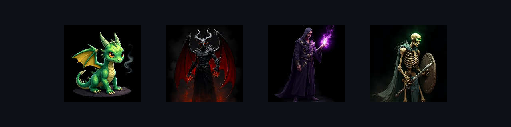
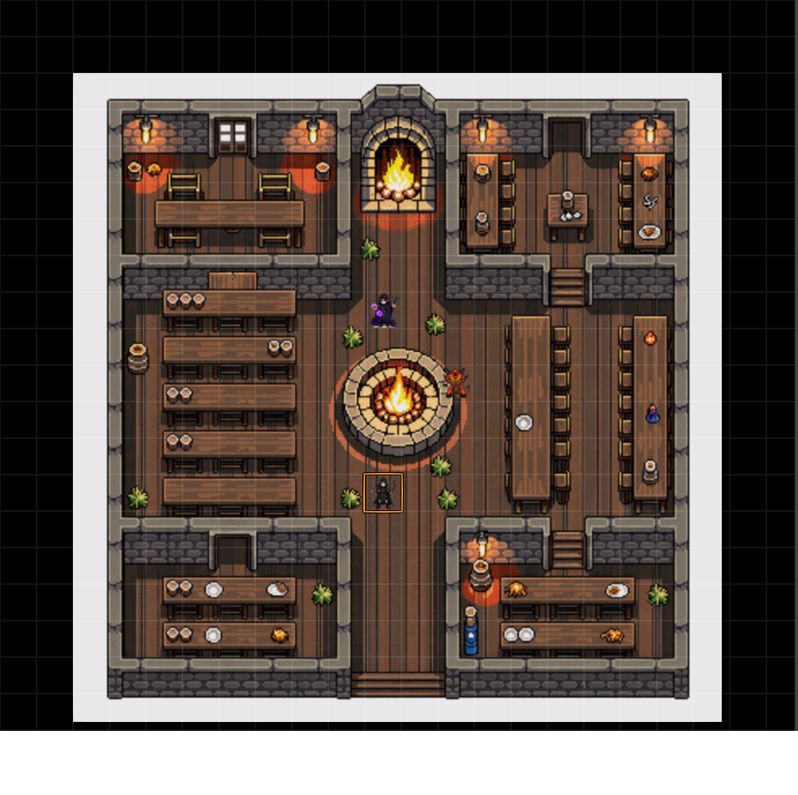
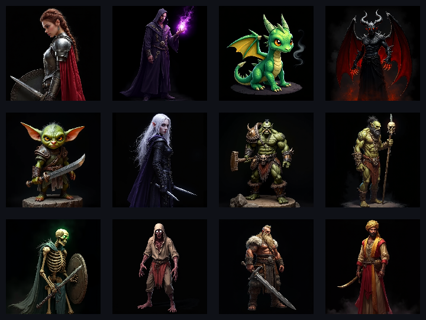
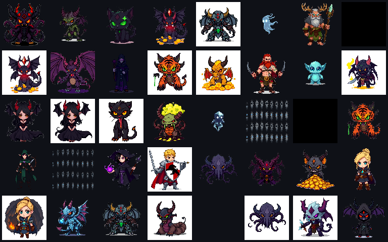
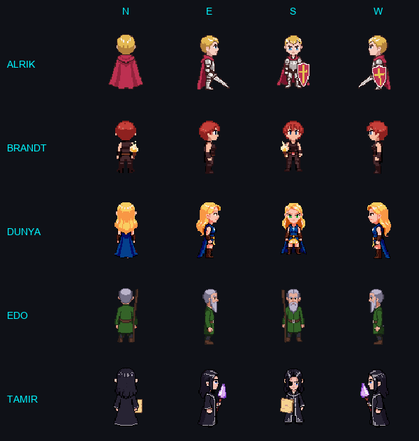
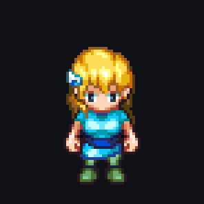

# DSA Pixel-Art Tokens



[](https://foundryvtt.com/)
[](https://github.com/cengo441337-a11y/dsa-pixel-tokens/releases)
[]()
[]()
[](https://paizo.com/orclicense)
[](https://ulisses-spiele.de/)
[]()
[]()
[]()
[]()
[]()
[]()

> ⚠️ **Fan-Projekt / Nicht offiziell** — *Das Schwarze Auge* und *DSA* sind eingetragene Marken der **Ulisses Spiele GmbH**. Dieses Modul steht in keiner kommerziellen Verbindung zum Verlag.
>
> **Rechteeinräumung:** Ulisses Spiele (Jan Wagner, Head of Digital Games) hat Deniz Ceylan mit
> Datum 2026‑04‑21 die **zeitlich und räumlich unbeschränkte Nutzung** von Inhalten, Regeln und
> Namen aus Büchern der DSA 4.1 Edition im Rahmen der **ORC‑Lizenzbestimmungen** für dieses
> Foundry‑VTT‑Modul eingeräumt. Nicht‑kommerziell. Keine Weitergabe/Sublizenzierung.
> Widerruflich durch Ulisses Spiele.
>
> **Verwendete Regelwerke** (© Ulisses Spiele GmbH):
> *Wege der Helden*, *Wege des Schwertes*, *Wege der Zauberei*, *Wege der Alchimie*,
> *Liber Cantiones (Remastered)*, *Von Toten und Untoten*, *Elementare Gewalten*,
> *Tractatus contra Daemones*.
>
> Der Modul‑Code (JavaScript, Sprites, VFX, Logik) steht unter **MIT‑Lizenz**.

> Komplettes Pixel-Art DSA 4.1 Erweiterungsmodul: Animierte Tokens, automatische Zauber- und Kampfeffekte, Pixel-Art Heldenbogen, Proben-Engine, Zonenzauber mit Schaden und 961 Regelbuch-Eintraege.

---

## Eindruecke

**Live auf der Spieltisch-Szene** — Taverne "Zum schwarzen Eber" mit Waldelfen-Wildnislaeufer, Magier und weiteren NSCs am Lagerfeuer:



**16 Charakter-Tokens** (von 700+ im Modul):



**Bestiarium** — 40 zufaellige Kreaturen von 700+:



**Chibi-NSCs** mit 4-Richtungs-Rotation (N / O / S / W):



**Laufanimation** (LPC-Spritesheet-Standard, 9 Frames, 4 Richtungen):

<p align="center">
  
  &nbsp;&nbsp;&nbsp;
  
</p>

---

## Was ist das?

Ein FoundryVTT-Modul das auf dem **gdsa** System (DSA 4.1) aufbaut und es um ein komplettes Pixel-Art Erlebnis erweitert:

- 16-Bit JRPG-Heldenbogen mit Retro-Design
- Automatische VFX bei Kampf und Magie
- Proben-System mit Patzer/Gluecklich-Erkennung
- 298 Zauber + 298 Liturgien + 72 Schamanen-Rituale + 167 Waffen + 86 Talente direkt aus den Regelbuchern
- Komplettes Karma-System für Geweihte (Mirakel, Aufstufung, Karmale Senkung)
- Schamanen mit 4 Geister-Fertigkeiten + Petromantie-Reskins für Wühlschrate
- Hochschamanen-Pantheons (Kamaluq/Tairach/Himmelswölfe)
- Helden-Software XML Import
- Zonenzauber mit Grid-Markierung und automatischem Schaden

---

## Features

### Pixel-Art Heldenbogen

6-Tab Character Sheet mit Retro-Theme (VT323 + Press Start 2P Fonts):

| Tab | Inhalt |
|-----|--------|
| **Werte** | 8 Eigenschaften (klickbar fuer Probe), Vorteile, Nachteile, SF |
| **Talente** | Alle Talent-Kategorien mit Probe und TaW (klickbar fuer 3W20) |
| **Kampf** | Kampftalente mit AT/PA, Waffen, Ruestung, RS/BE |
| **Magie** | Zauberliste mit Probe/ZfW/AsP, klickbar fuer Zauberprobe |
| **Inventar** | Ausruestung, Geld (Dukaten/Silber/Heller/Kreuzer) |
| **Notizen** | Freitext mit Rich-Text Editor |

- Animierte LeP/AsP/AuP-Balken (klickbar zum Bearbeiten)
- Abgeleitete Werte: INI, MR, GS, WS, AT, PA, FK, AW
- Pixel-Art Borders, Retro-Buttons, Gold-Akzente

### Proben-System

- **Eigenschaftsprobe** (1W20): Modifikator-Dialog, Erfolg/Misserfolg/Kritisch/Patzer
- **Talentprobe** (3W20): TaP*-Berechnung, Patzer (Doppel-20), Gluecklich (Doppel-1)
- **Angriff/Parade** (1W20): Kritischer Treffer, Patzer mit Bestaetigungswurf
- **Zauberprobe** (3W20): ZfP*-Berechnung, Spontanmodifikationen, Auto-AsP-Abzug
- Alle Proben mit Pixel-Art Chat-Output und automatischen VFX

### Kampf-System

- **Manoever-Dialog**: 6 Kampfmanoever (Normal, Wuchtschlag, Finte, Gezielter Stich, Meisterparade, Ausweichen) mit AT/PA-Modifikatoren
- **Schaden-Dialog**: TP + KK-Bonus - RS = SP mit Live-Berechnung
- **Wundschwellen**: Automatische Pruefung (KO/2, KO, KO*1.5)
- **Fernkampf**: Reichweiten-Modifikatoren (Nah/Mittel/Fern/Sehr fern)
- **Auto-VFX**: Treffer-Flash, Verfehlung, Fernkampf-Projektile

### Magie-System

- **Spontanmodifikations-Dialog**: 5 Modifikationstypen (Reichweite, Zauberdauer, Wirkungsdauer, Kosten, Erzwingen) mit Live-AsP-Berechnung
- **Auto-Effekte**: Nach erfolgreicher Probe automatisch VFX (Projektil/Aura/Target/Zone)
- **Zonenzauber**: Template platzieren, Zone-Effekt waehlen, Schaden anwenden
- **Zone-Damage**: LeP-Abzug fuer alle Token in der Zone, AsP-Abzug beim Caster
- **Floating Damage Numbers**: Rote/blaue Zahlen schweben ueber betroffenen Token

### Liturgien & Karma-System (DSA 4.1 Liber Liturgium)

- **298 Liturgien** mit komplettem PDF-Volltext (Symbole/Gesten/Gebete + Auswirkung + Anmerkungen)
- **Liturgien-Browser** mit Filter (Gott / Grad I-VIII / Suche), klappbare Detail-Sektionen
- **Mirakel-Schnellbuttons**: ±0 / +6 / +18 — Probe via 1W20 ≤ LkW
- **Aufstufungs-Dialog**: 4 Kategorien (Ritualdauer/Reichweite/Wirkungsdauer/Ziel) mit automatischer KaP/pKaP-Berechnung und 3×Grad ≤ LkW Constraint
- **Modifikatoren-Tabelle**: Notlage, eigener Tempel, Feiertag, Limbus, Mitbeter etc. (Liber Liturgium S.16-18)
- **Primäre Segnung** mit -2 Erleichterung + 2 KaP für Heimatkult
- **Hochschamanen-Pantheons**: Kamaluq, Tairach, Himmelswölfe — 33 Pantheon-Liturgien + 12 KaP fixe Pool + Mirakel via *Geister aufnehmen*

### Schamanen-Rituale & Petromantie (DSA 4.1 Wege der Zauberei + Elementare Gewalten)

- **72 Schamanen-Rituale** über 11 Kulturen (Wdm/Utu/Toc/Niv/Ork/Gob/Gja/Fer/Tzk/Ach/Wuhl)
- **Vier Geister-Fertigkeiten**: Geister rufen / bannen / binden / aufnehmen
- **AsP-Würfel pro Grad** (1W6 → 6W6, ab Grad V mit 1/10 permanent)
- **Schamanen-Browser** mit Filter (Kultur/Fertigkeit/Suche)
- **18 Petromantie-Rituale** (Erz-Reskins für Wühlschrate)
- **Knochenkeulen-Tabelle** + 9 Keulen-Rituale (Bann/Geist/Hilfe/Kraft/Härte/Nähe/Hilfe der Keule + Opferkeule)
- **38 Edelsteine** mit Element-Bonus-Mapping (Edelsteinmagie-SF)

### Beschwörungs-Magie

- **Misslingen-Tabellen** für Anrufung (2W6 / 3W6 Blutmagie) + Beherrschung
- **Pakt-Mechanik** mit GP-Pool (3 GP = -1 Erleichterung)
- **Wahrer-Name-Qualität** (Q1/Q2) + "Ohne-Namen"-Toggle (+7 Anrufung)
- **Kontroll-Probe** nach erfolgreicher Anrufung (1W20 ≤ Kontrollwert)
- **MR-Boni gegen Spruchmerkmal** (Eiserner Wille I/II, Gedankenschutz)

### Aventurischer Kalender

- 12 Götter-Monate, 7 Wochentage, Namenlose Tage, 8 Feiertage
- GM-Steuerung (±Tag/Woche/Monat/Jahr) + Datum-Setzen-Dialog
- Sidebar-Button für Token-Tools

### 34 Zaubereffekte (Pixel-Art Animationen)

| Typ | Effekte |
|-----|---------|
| **Projektile** | Flammenpfeil, Donnerkeil, Aquafaxius, Odem Arcanum |
| **Ziel-Effekte** | Feuerball, Eis, Blitz, Heilung, Gift, Fulminictus, Horriphobus, Respondami, Motoricus, Balsamsal |
| **Auren** | Armatrutz, Visibili, Attributo, Schattenform, Verwandlung, Brennen, Paralysis, Silentium |
| **Zonen** | Pandemonium, Fesselranken, Invocatio, Daemonenbann, Portal, Planastral, Wind |
| **Reaktionen** | Schadenflash (auto bei LeP-Verlust), Tod-Animation (auto bei LeP 0) |

### 6 Zonen-Effekte (Persistent, Grid-basiert)

| Zone | Typ | Persistent |
|------|-----|-----------|
| Feuerzone | Fill | Ja |
| Eiszone | Fill | Ja |
| Giftzone | Fill | Ja |
| Heilzone | Fill | Ja |
| Sturmzone | Scatter | Nein |
| Dunkelzone | Fill | Ja |

### Animierte Token-Sprites

- **LPC-Spritesheets** (576x256px, 4 Richtungen x 9 Frames)
- **100+ Token**: Magier, Krieger, Druidin, Hexe, Geweihte, Schurke, Soeldner, Elementare, Daemonen, Zombies, Skelette
- **Kreaturen**: Baer, Fuchs, Ratte, Loewe, Pilzmensch, Hai, Hirsch u.v.m.
- **4-Richtungs-Laufanimation**: Automatisch bei Token-Bewegung
- **Pixel-Art Status-Icons**: Vergiftet, Betaeubt, Gesegnet, Gelaehmt, Verwirrt, Blind, Tot, Brennend

### Dice Hooks (gdsa Integration)

- Faengt gdsa Chat-Nachrichten ab und triggert automatisch VFX
- Sound-Effekte bei Treffer/Verfehlung/Patzer/Gluecklich
- Fernkampf-Erkennung: Projektil-Animation wenn Distanz > 2 Felder
- gdsa Parade/Schaden-Buttons mit Pixel-Art Styling

### Helden-Software XML Import

- Datei-Upload Dialog mit Live-Preview
- Parst: Eigenschaften, Talente, Kampftalente, Zauber, V/N/SF, Ausruestung
- Erstellt gdsa-kompatiblen Actor mit allen Items
- Unterstuetzt verschiedene Helden-Software Versionen

---

## Datenbank (1.500+ Eintraege aus Regelbuchern)

Alle Daten direkt aus den offiziellen DSA 4.1 Regelbuchern extrahiert:

| Datei | Eintraege | Quelle |
|-------|-----------|--------|
| `data/spells.json` | 298 Zauber | Liber Cantiones Remastered |
| `data/liturgien.json` | **298 Liturgien** (mit Symbole/Auswirkung/Anmerkungen) | Liber Liturgium |
| `data/schamanen-rituale.json` | **72 Schamanen-Rituale** (54 Standard + 18 Petromantie) | Wege der Zauberei + Elementare Gewalten |
| `data/edelsteine.json` | **38 Edelsteine** (Element-Bonus-Mapping) | Elementare Gewalten S.154-155 |
| `data/calendar.json` | Aventurischer Kalender | DSA 4.1 |
| `data/daemons.json` | Daemon-Datenbank mit BS/Wahrer-Name | Tractatus Contra Daemones |
| `data/talents.json` | 86 Talente | Wege der Helden |
| `data/weapons.json` | 144 Nahkampf + 23 Fernkampf | Wege des Schwertes |
| `data/weapons.json` | 17 Schilde + 45 Manoever | Wege des Schwertes |
| `data/armor.json` | 42 Ruestungen + Helme | Wege des Schwertes |
| `data/advantages.json` | 85 Vorteile | Wege der Helden |
| `data/disadvantages.json` | 126 Nachteile | Wege der Helden |
| `data/special-abilities.json` | **176 Sonderfertigkeiten** (inkl. 20 Liturgie-SFs + 13 Schamane-SFs + 5 Petromantie-SFs) | Wege der Helden + Schwertes + Götter + Zauberei |
| `data/creatures.json` | 155 Kreaturen + Daemonen + Elementare | DSA-Bestiarien |

---

## Installation

### Per Manifest URL (empfohlen)
1. FoundryVTT -> **Add-on Module** -> **Install Module**
2. Manifest URL:
   ```
   https://raw.githubusercontent.com/cengo441337-a11y/dsa-pixel-tokens/main/module.json
   ```

> *Alter Gitea-Mirror:* `https://git.dc-infosec.de/admin/dsa-pixel-tokens/raw/branch/main/module.json`

### Lokal (Entwicklung)
```bash
# Windows Symlink
mklink /D "D:\Users\<user>\AppData\Local\FoundryVTT\Data\modules\dsa-pixel-tokens" "E:\Dev\foundry-modules\dsa-pixel-tokens"
```

### Voraussetzungen
- FoundryVTT v12
- gdsa System (DSA 4.1)
- socketlib Modul

---

## Modul-Architektur

```
dsa-pixel-tokens/
├── scripts/
│   ├── module.mjs          # Entry Point, Sheet-Override, Data-Loader
│   ├── config.mjs          # DSA 4.1 Formeln, Proben-Engine, Konstanten
│   ├── sheet.mjs           # Pixel-Art Character Sheet (6 Tabs)
│   ├── dice-hooks.mjs      # gdsa Chat -> Auto-VFX + Sound
│   ├── combat.mjs          # Manoever, Schaden, Wundschwellen, Fernkampf
│   ├── magic.mjs           # Zauberprobe, Spontanmods, Zone-Auto-Trigger
│   ├── xml-parser.mjs      # Helden-Software XML Import
│   └── pixel-tokens.mjs    # Sprite-System, 34 Effekte, 6 Zonen, Zone-Damage
├── templates/
│   └── sheet/
│       └── character-sheet.hbs
├── styles/
│   ├── pixel-tokens.css    # Sprite/Token CSS
│   ├── sheet.css           # Character Sheet (Retro Theme)
│   └── dialogs.css         # Probe/Kampf/Magie Dialoge + Chat
├── data/                   # 7 JSON-Datenbanken (961 Eintraege)
├── assets/                 # 200+ PNGs, 6 WAVs
├── tools/                  # PDF-Extraktions-Scripts
└── module.json
```

---

## Assets generieren

```bash
# Zaubereffekte (Spritesheets)
python assets/build_effects.py

# Zonen-Tiles (64x64 tileable)
# Wird am Ende von build_effects.py generiert

# Monster-Sprites
python assets/build_monsters.py
```

**Abhaengigkeiten:** `pip install Pillow numpy`

---

## Roadmap

### Erledigt in 0.5.0
- [x] **Liber Liturgium**: 298 Liturgien mit komplettem PDF-Volltext
- [x] **Karma-System**: KaP-Pool, Mirakel, Aufstufung, Karmale Senkung
- [x] **Schamanen**: 4 Geister-Fertigkeiten + 72 Rituale über 11 Kulturen
- [x] **Petromantie**: 18 Reskins für Wühlschrat-Schamanen
- [x] **Hochschamanen**: Kamaluq/Tairach/Himmelswölfe Pantheons
- [x] **Edelsteinmagie**: 38 Edelsteine mit Element-Bonus
- [x] **Tractatus Contra Daemones**: Daemonen-DB + Misslingen-Tabellen + Pakt-Mechanik
- [x] **Elementare Gewalten**: Eis/Erz-Elementare-Statblocks
- [x] **Aventurischer Kalender**: 12 Götter-Monate, Feiertage

### Offen
- [ ] Spontanmodifikationen auf ZfP-basiert korrigieren (WdZ-konform)
- [ ] Wege der Alchimie: Zauberzeichen, Artefakt-Erschaffung, Traenke
- [ ] Von Toten und Untoten: Untote, Golems, Chimaeren (volle Stat-DBs)
- [ ] Groessere Kreaturen (2x2, 3x3 Token)
- [ ] Effekt-Vorschau-Dialog
- [ ] Zauberproben-Hook (auto-trigger bei gdsa Spell Check)
- [ ] Screen-Effects (Kamera-Shake, Fade-to-Black, LP-Vignette)
- [ ] effect-mappings.json (Zauber -> VFX vollstaendig verknuepfen)
- [ ] Wege der Götter: Hochschamanen-Liturgien-Volldaten
- [ ] Liturgie-Aufstufung als SF pro Liturgie

---

## Credits & Lizenz

### Modul-Code
- Entwickelt von **Deniz Ceylan** ([dc-infosec.de](https://dc-infosec.de))
- Lizenz: **MIT** (siehe `LICENSE`) — betrifft ausschliesslich den JavaScript-Code, die prozedural erzeugten Sprites/VFX und die Modul-Architektur

### Assets
- Sprite-Design: Prozedural (Python/Pillow) — inspiriert vom [LPC Spritesheet Standard](https://lpc.opengameart.org/)
- Chibi-Charaktere: [PixelLab AI](https://pixellab.ai) (Nutzungsbedingungen des Dienstes)
- Sounds: RPG Sound Pack (OpenGameArt, CC0/CC-BY)

### Regeldaten & DSA-Inhalte
Die in `data/creatures.json`, `data/spells.json` und den Kampf-/Talent-/Sonderfertigkeits-Definitionen
enthaltenen DSA 4.1 Regelwerte (Zauber-Mechaniken, Kreatur-Stats, Waffen-TP, Eigenschaften)
stammen aus den offiziellen **DSA 4.1 Regelwerken** der **Ulisses Spiele GmbH**:

- *Wege der Helden* (Grundregelwerk)
- *Wege des Schwertes* (Kampfregeln, Waffen)
- *Wege der Zauberei* (Magieregeln)
- *Wege der Alchimie* (Alchimie, Tränke)
- *Liber Cantiones (Remastered)* (Zaubersprüche)
- *Von Toten und Untoten* (Untoten-Bestiarium)
- *Elementare Gewalten* (Elementar-Bestiarium)
- *Tractatus contra Daemones* (Dämonen-Bestiarium)

Die Nutzung erfolgt unter der **ORC‑Lizenz** (Open RPG Creative License) mit **ausdrücklicher
persönlicher Rechteeinräumung** durch Jan Wagner, Head of Digital Games bei Ulisses Spiele
(E-Mail vom 2026-04-21). Die Rechteeinräumung ist zeitlich und räumlich unbeschränkt,
nicht übertragbar, nicht sublizenzierbar und durch Ulisses Spiele einseitig widerruflich.

**„Das Schwarze Auge", „DSA", „Aventurien"** sind Marken der Ulisses Spiele GmbH.
Dieses Projekt ist **nicht offiziell**, nicht kommerziell, und steht nur im Rahmen der
gewährten Rechteeinräumung in Verbindung zum Verlag. Nutzung setzt eine gültige
FoundryVTT-Lizenz voraus.

---

*Fuer den privaten Einsatz mit lizenziertem FoundryVTT und DSA-Regelwerk. Keine kommerzielle Nutzung.*
